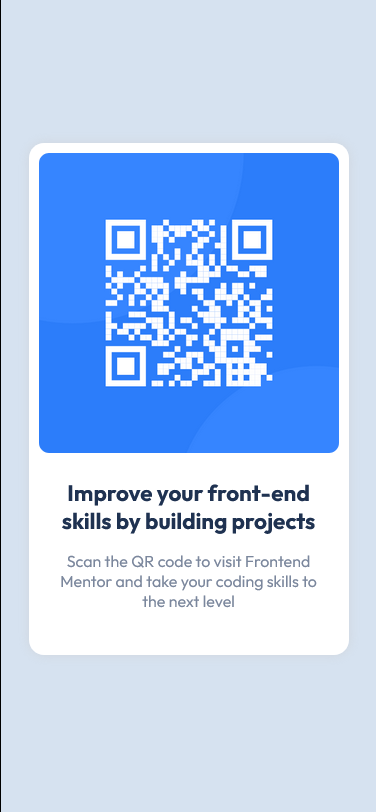
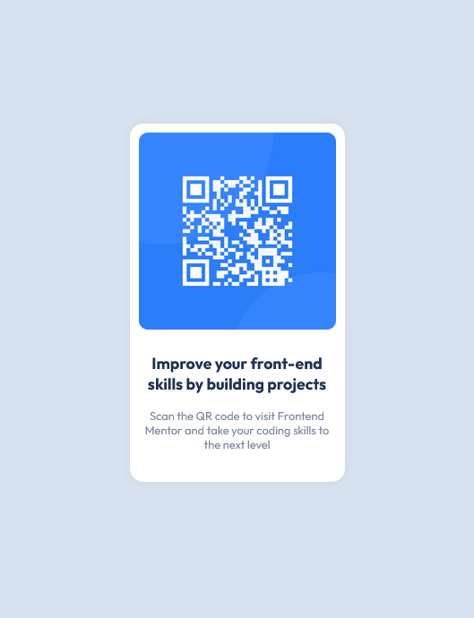
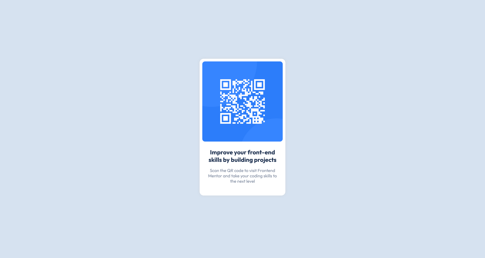

# Frontend Mentor - QR code component

## Table of contents

- [Overview](#overview)
  - [Screenshot](#screenshot)
  - [Links](#links)
- [Built with](#built-with)
  - [What I learned](#what-i-learned)
  - [Continued development](#continued-development)
  - [Useful resources](#useful-resources)
- [Author](#author)

## Overview

### Screenshot
  
  - Screen size(max-width : 375px)

   

  - As the screen height reaches 800px and higher, the QR code will change size for better readability.
  - Screen size(height >= 800)
  
  
   
  - Desktop visual
  
  
   
  
    

### Links

- Solution URL: [Add solution URL here](https://your-solution-url.com)

## Built with

- Semantic HTML5 markup
- CSS custom properties
- Flexbox
- Mobile-first workflow
- @media
- Angular